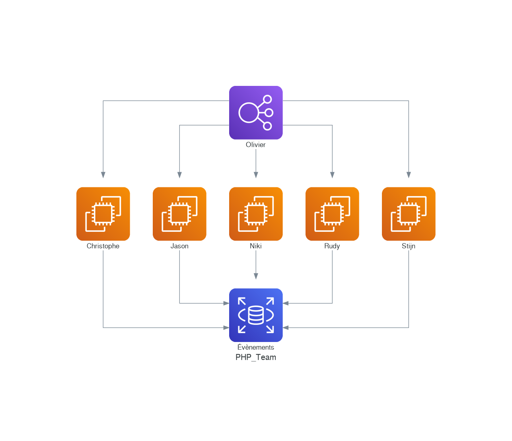

# Diagrams as code


This repository is just a quick reference to how to use *Diagrams as code* ([https://github.com/mingrammer/diagrams](https://github.com/mingrammer/diagrams)), an Open source project that will convert Python code to diagrams.

The following example is based on [https://diagrams.mingrammer.com/docs/getting-started/examples#grouped-workers-on-aws](https://diagrams.mingrammer.com/docs/getting-started/examples#grouped-workers-on-aws) and, f.i., display a team of workers; very basic:

```python
from diagrams import Diagram
from diagrams.aws.compute import EC2
from diagrams.aws.database import RDS
from diagrams.aws.network import ELB

with Diagram("PHP_Team", show=False, direction="TB"):
    ELB("Olivier") >> [
        EC2("Christophe"),
        EC2("Jason"),
        EC2("Niki"),
        EC2("Rudy"),
        EC2("Stijn") ] >> RDS("Évènements")
```



To run the conversion, you just need to have Docker installed on your machine then run the following command:

```bash
cat php_team.py | docker run -i --rm -v $(pwd)/images:/out gtramontina/diagrams:0.22.0
```

Note: if you're working Windows, replace `$(pwd)` by `%CD%`. And replace `cat` by `type`.

```bash
type php_team.py | docker run -i --rm -v %CD%/out:/out gtramontina/diagrams:0.22.0
```

*0.22.0 is the latest version available when writing this document. See [https://hub.docker.com/r/gtramontina/diagrams/tags](https://hub.docker.com/r/gtramontina/diagrams/tags) to retrieve the latest one.*

A more sophisticated diagram can be:

.png)

More samples on [https://diagrams.mingrammer.com/docs/getting-started/examples](https://diagrams.mingrammer.com/docs/getting-started/examples)

The Docker image code base is here: [https://github.com/gtramontina/docker-diagrams](https://github.com/gtramontina/docker-diagrams).

## Another tools

* [Mermaid](https://mermaid-js.github.io/mermaid/), his [live editor](https://mermaid.live/), the [preview addon for vscode](https://marketplace.visualstudio.com/items?itemName=vstirbu.vscode-mermaid-preview) and the [convert tool as a CLI tool](https://github.com/mermaid-js/mermaid-cli)
* [Sequence diagram](https://sequencediagram.org/) *(seems based on Mermaid)*
* [yEd Graph Editor](https://www.yworks.com/products/yed)
